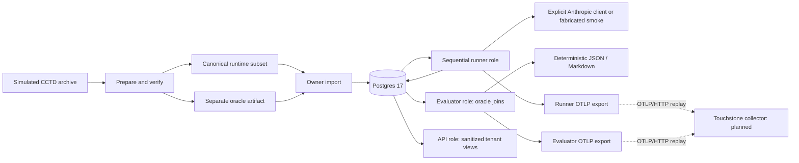

# Current and planned architecture

All transaction data is simulated. Phase 1 implements the Reckoner batch CLI, role-separated
Postgres persistence, operational API, oracle evaluation, reports, and durable OTLP export.
The CLI and API are installed from the same wheel and container image. A paid baseline is a
separate acceptance result; the offline deployment checks use four fabricated cases only.

The [Structurizr model](workspace.dsl) marks the baseline software `Implemented`, with a `Baseline`
view. Its original `Foundation` view retains the profiler/API boundary from Phase 0. The LangGraph
cascade, Jev, graph, vector retrieval, frontend, collector, ClickHouse and warehouse are `Planned`.
There is no implemented agent graph to draw in this phase.

The runner receives only `bundle.json`, the chosen runtime JSONL, and its two tenant manifests.
Owner import validates the complete prepared bundle. The API receives only its own DSN, and the
runner cannot read oracle/evaluation tables. Fake smoke is explicit, fixed, isolated to a
`reckoner_smoke_` database, and rejected by the paid CLI. Missing credentials never select fake mode.

Postgres persists reservations before dispatch. An uncertain call retains its reservation and
blocks later dispatch across runs. Completed calls are skipped on resume. The evaluator retains
failed cases in denominators; missing outcomes/usage withhold full CPST. Provider cost belongs to
one call identity, while runner and evaluator telemetry remain separate durable streams.

Touchstone ingests only through OTLP. It does not import Reckoner or read operational tables.
Future metric models use `workflow_id`, `node_name`, and `tenant_id`; fraud-specific calculations
remain within Reckoner. A synthetic second workflow remains scheduled with the platform.

Compose and kind run separately. Each uses Postgres persistence, explicit owner migrations,
512 MiB Postgres/API/CLI limits, `/health/live` liveness, and `/health/ready` migration-aware
readiness. No archive, measured oracle, or provider credential is mounted into the API.

## Phase 1 drift check

The archify skill checked an eight-component architecture candidate against these source seams:
`data/cohort.py`, `storage/postgres.py`, `baseline/runner.py`, `baseline/provider.py`, `smoke.py`,
`api.py`, `baseline/evaluate.py`, `baseline/report.py`, and `telemetry/otlp.py` under
`workloads/reckoner/src/reckoner/`. The checked candidate and receipt are local ignored artifacts
under `artifacts/phase1-architecture/`; they contain no source transactions or credentials.

The validator passed all nine showcase artifact checks with no composition errors or warnings.
This is a code/diagram drift check and deterministic layout validation, not browser or perceptual
visual review. The repository has no pinned public source URL; local source links were recorded
in a separate evidence mapping rather than inventing public URLs. The current/planned model was
updated to remove the Phase 0 claim that persistence and baseline processing were absent.
