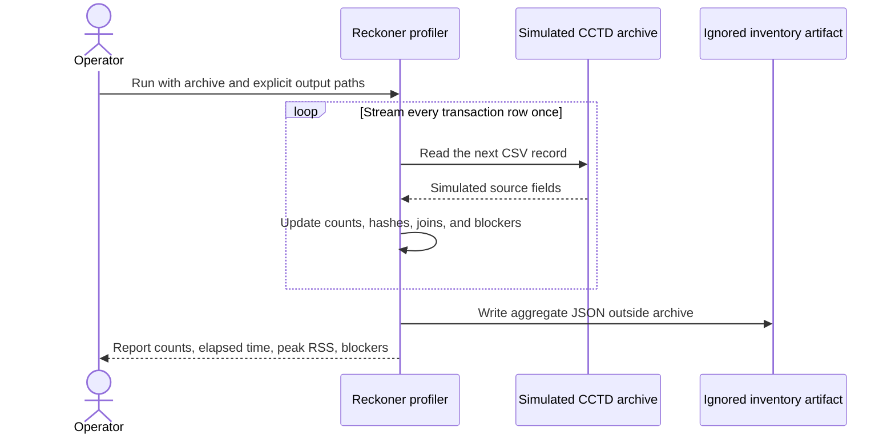

# Foundation architecture

The Phase 0 runtime contains one implemented HTTP surface: Reckoner's liveness API. The source
profiler is also implemented as a local CLI. Both use fabricated or simulated data only. The
database, decision-pipeline, telemetry, provider, warehouse, and web containers in the
[Structurizr model](workspace.dsl) are marked `Planned`; they are architectural intent rather than
running services. The model's `Foundation` view contains only the two implemented components.

The platform boundary is fixed before those planned services exist: Reckoner will send generic
workflow measurements to Touchstone only through OTLP. Touchstone must not import Reckoner code or
read its operational tables to derive metrics. Future metric models key on generic dimensions such
as `workflow_id`, `node_name`, and `tenant_id`, while fraud-specific calculations remain in the
workload.

The current liveness endpoint has no tenant because it creates no application or measurement
record. It tests process availability only; it is not a readiness claim for any planned store or
model provider.

## Implemented source-inventory flow

There is no LangGraph runtime in Phase 0, so no agent graph is drawn.
