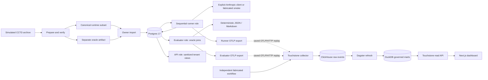

# Current and planned architecture

All transaction data is simulated. Phase 1 implements the Reckoner batch CLI, role-separated
Postgres persistence, operational API, oracle evaluation, reports, and durable OTLP export.
The CLI and API are installed from the same wheel and container image. A paid baseline is a
separate acceptance result; the offline deployment checks use four fabricated cases only.

The [Structurizr model](workspace.dsl) marks the Phase 1 baseline and Phase 2 local measurement
software `Implemented`, with separate `Baseline` and `LocalMeasurement` views. The original
`Foundation` view retains the profiler/API boundary from Phase 0. The LangGraph cascade, Jev,
graph/vector retrieval and reviewer interface remain `Planned`. There is no implemented agent
graph to draw in this phase. DuckDB is the verified local warehouse; Snowflake is a configured
future boundary with no live parity claim. The [generated dbt lineage](dbt-lineage.md) records
the direct model and source dependencies in the final image's manifest.

```mermaid
flowchart LR
    Source[Simulated CCTD archive] --> Prepare[Prepare and verify]
    Prepare --> Runtime[Canonical runtime subset]
    Prepare --> Oracle[Separate oracle artifact]
    Runtime --> Import[Owner import]
    Oracle --> Import
    Import --> DB[(Postgres 17)]
    DB --> Runner[Sequential runner role]
    Runner --> Provider[Explicit Anthropic client or fabricated smoke]
    Runner --> DB
    DB --> Evaluator[Evaluator role: oracle joins]
    Evaluator --> Report[Deterministic JSON / Markdown]
    DB --> API[API role: sanitized tenant views]
    Runner --> OTLP[Runner OTLP export]
    Evaluator --> EOTLP[Evaluator OTLP export]
    OTLP -. saved OTLP/HTTP replay .-> Collector[Touchstone collector]
    EOTLP -. saved OTLP/HTTP replay .-> Collector
    Synthetic[Independent fabricated workflow] --> Collector
    Collector --> CH[(ClickHouse raw events)]
    CH --> Dagster[Dagster refresh]
    Dagster --> Warehouse[(DuckDB governed marts)]
    Warehouse --> ReadAPI[Touchstone read API]
    ReadAPI --> Web[Next.js dashboard]
```

The runner receives only `bundle.json`, the chosen runtime JSONL, and its two tenant manifests.
Owner import validates the complete prepared bundle. The API receives only its own DSN, and the
runner cannot read oracle/evaluation tables. Fake smoke is explicit, fixed, isolated to a
`reckoner_smoke_` database, and rejected by the paid CLI. Missing credentials never select fake mode.

Postgres persists reservations before dispatch. An uncertain call retains its reservation and
blocks later dispatch across runs. Completed calls are skipped on resume. The evaluator retains
failed cases in denominators; missing outcomes/usage withhold full CPST. Provider cost belongs to
one call identity, while runner and evaluator telemetry remain separate durable streams.

Touchstone ingests only through OTLP. It does not import Reckoner or read operational tables.
Metric models use `workflow_id`, `node_name`, and `tenant_id`; fraud-specific calculations remain
within Reckoner's emitted generic contributions. The second workflow is deterministic and
fabricated. Dagster's schedule is disabled by default; explicit refreshes publish immutable
warehouse generations only after dbt, MetricFlow and Elementary checks succeed.

Phase 1 Compose and kind use Postgres persistence, explicit owner migrations and migration-aware
readiness. Phase 2 Compose and kind run separately from each other and from Phase 1, with bounded
ClickHouse, collector, warehouse, API and web resources. Saved exports mount read-only only in a
dedicated replay container; the measured oracle is used only by acceptance verification. No
provider credential or oracle is mounted into the read API.

## Phase 1 drift check

The archify skill checked an eight-component architecture candidate against these source seams:
`data/cohort.py`, `storage/postgres.py`, `baseline/runner.py`, `baseline/provider.py`, `smoke.py`,
`api.py`, `baseline/evaluate.py`, `baseline/report.py`, and `telemetry/otlp.py` under
`workloads/reckoner/src/reckoner/`. The checked candidate and receipt are local ignored artifacts
under `artifacts/phase1-architecture/`; they contain no source transactions or credentials.

The validator passed all nine showcase artifact checks with no composition errors or warnings.
This is a code/diagram drift check and deterministic layout validation, not browser or perceptual
visual review. The repository has no pinned public source URL; local source links were recorded
in a separate evidence mapping rather than inventing public URLs. The current/planned model was
updated to remove the Phase 0 claim that persistence and baseline processing were absent.

## Phase 2 drift check

The Phase 2 candidate traces collector configuration and OTLP replay to ClickHouse, the Dagster
refresh and dbt/MetricFlow/Elementary publication path, then FastAPI to Next.js. It also records
the separate synthetic emitter and warehouse-only acceptance verifier. The local candidate and
validation receipt are kept under ignored `artifacts/phase2-architecture/`; source-level
relationships are reflected in the `LocalMeasurement` Structurizr view. The showcase validator
passed all nine artifact checks with zero composition errors or warnings. The delivered HTML's
automated browser check passed light/dark 1440×900 and 2048×1320 containment/readability. Separate
real-Chrome checks on the same frozen HTML found no overflow at 1600×1000 or 1920×1080. The
1440×900 and 1920×1080 light screenshots were visually inspected; the controller separately
inspected 2048×1320 light. This is a code/diagram drift check, not a Snowflake
deployment or visual dashboard test.
