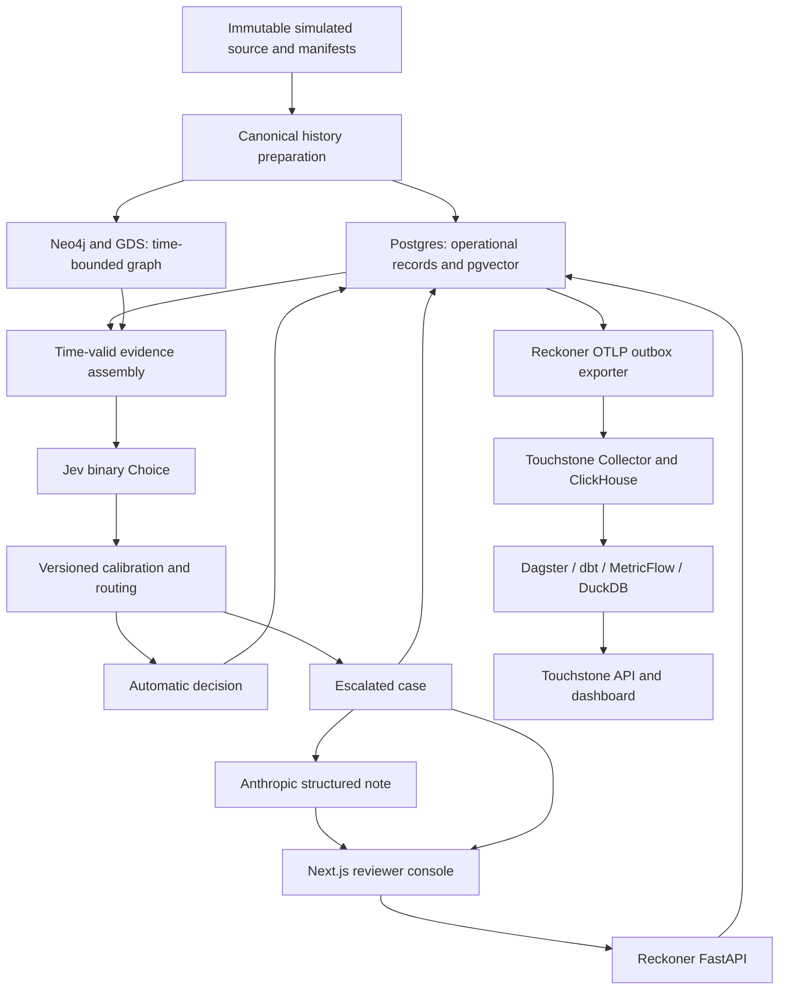

# 004 — Reckoner v1

**Status:** Proposed written specification. The owner approved the conversational
design; review of this document and then a separate implementation plan remain.
**Date:** 2026-09-30.
**Starting revision:** `e5832a594c9de78c4cb0804d9e5ed2712e108831` (Phases 0–2).
**Sources:** [Foundation](000-foundation.md), [Touchstone v1](003-touchstone-v1.md),
the completed baseline, and the Phase 3 discovery conversation.

## 1. Outcome, scope, and explicit amendments

Build Reckoner v1 and use Touchstone to show how its cost, correctness, latency,
and evidence compare with the existing naive baseline on the same frozen cohort.
Touchstone remains the primary deliverable. All transaction data is simulated;
provider executions are real only when recorded as such. An unfavorable result
is valid evidence, not a reason to change the test or manufacture an improvement.

Phase 3 includes Jev scoring and calibration diagnostics, LangGraph orchestration,
amount-aware routing, Neo4j/GDS evidence, a Postgres/pgvector comparison, structured
Anthropic notes, a reviewer console, simulated review, immutable configuration
history, and a measured baseline/current dashboard comparison. Compose and local
kind must both support the introduced services, exercised separately.

The owner explicitly agreed to these amendments and refinements:

- Replace model feature attribution with up to three ranked, evidence-backed risk
  indicators. Their ranking method and sources are recorded. They are not claims
  about Jev's internal reasoning. This supersedes foundation §6.3's attribution
  requirement; unavailable evidence remains explicit.
- Model historical reviews as resolved seven days after each transaction. This is
  an experimental availability assumption, not a fact supplied by CCTD.
- Use binary Jev Choice (`fraud`, `legitimate`), retaining fraud probability and
  the separately returned confidence. Check calibration before using thresholds.
- Use normalized structured features for pgvector similarity initially. No new
  embedding provider or text-embedding model is required.
- Add model configuration to the settings surface now, alongside thresholds.
  Haiku remains the initial case-note model.

Snowflake remains deferred. DuckDB results are labelled local previews. Phase 4
retains threshold-grid optimization, full budget/alert dashboards, coverage and
regression views, and expanded agreement/cost-to-serve reporting. Phase 3 supplies
their underlying records, basic provider spend enforcement, and review events.
No authentication product, RBAC UI, onboarding, NestJS service, self-hosted LLM,
synthetic device/IP evidence, or external notifications are added.

## 2. Architecture and ownership



This is a conceptual data-flow diagram. The implementation also generates the
actual LangGraph diagram and maintains Structurizr architecture views.

Reckoner owns fraud semantics, time filtering, calibration, business-cost formulas,
reviews, and note evaluations. Touchstone receives only generic OTLP events and
run declarations. It never reads Reckoner operational tables or imports Reckoner
code to calculate metrics. The outbox exporter is part of Reckoner.

One Next.js application serves the dashboard, console, and settings. Its server
calls separate operational and measurement APIs; API credentials never reach the
browser. Python/FastAPI, uv, existing package layouts, and existing conventions
remain. LangGraph coordinates persisted workflow state; Postgres records are the
authority for decisions, paid-call reservations, and reviewer actions.

## 3. Data, experiment clocks, and temporal eligibility

Keep the existing source checksums, canonical transaction identities, two-tenant
assignment, USD/UTC assumptions, and frozen 2019 cohort: 1,000 unique transactions,
100 fraud and 900 legitimate. Preserve the original measured baseline artifacts
and provider ledger. Do not rerun the baseline to ingest or compare it.

Distinguish source transaction time, experimental evidence-availability time, and
actual execution/review wall-clock time. Latency uses actual execution durations;
historical retrieval uses the transaction being evaluated as its cutoff.

For a query transaction at time `t`:

- Historical transaction evidence must have source time strictly before `t`.
  Equal timestamps are excluded because the source does not establish their order.
- A historical simulated outcome becomes eligible when
  `resolved_at = transaction_time + 7 * 24 hours` is strictly before `t`.
- Labels for the current case, later outcomes, and future graph edges are never
  exposed to the scorer, note generator, or runtime feature calculations.
- The privileged historical-review preparation process can read oracle labels;
  it publishes versioned resolution records. Runtime access is through a cutoff-
  enforcing evidence adapter, not unrestricted oracle-table access.
- Real human actions use actual review timestamps and remain distinct from the
  historical simulation. A current human click does not become historical evidence
  for a transaction from 2019.

Use complete retained-user histories backed by the immutable archive. Preserve
all source fraud and the foundation's history-retention rules. A bounded active
graph is permitted only with a frozen entity manifest and complete histories for
its selected entities. Report transactions, entities, time range, and uncovered
query cases; never silently truncate histories to meet memory limits.

The history-resolution policy has its own version. The seven-day assumption is
visible in evidence, evaluation reports, and comparisons. It does not demonstrate
real reviewer accuracy or real dispute-resolution speed.

## 4. Jev integration and scoring

Use the documented TypeSafe evaluation endpoint with a pinned model and a binary
Choice question. Preserve the complete distribution, confidence, requested and
reported model, token usage, request hash, and question version. The raw routing
input is `probabilities.fraud`; confidence is a separate descriptive field and
does not introduce an unapproved extra routing threshold.

The local secret is `JEV_API_KEY`, explicitly passed by the application. Do not
depend on the SDK's differently named default environment variable. Never include
the key in configurations, telemetry, screenshots, commits, or API responses.

Validate finite probabilities in [0,1], exactly the declared alternatives, a sum
of one within 1e-6, a consistent selected alternative, valid confidence, and the
reported model. Missing or malformed values cause a recorded provider failure;
they never become zero risk. Preserve the raw response for protected experiment
evidence while keeping prompts and response bodies out of generic telemetry.

Send canonical transaction fields and a bounded, explicitly structured evidence
summary. Compute arithmetic, counts, time comparisons, and historical statistics
in Python. Exclude card numbers, CVVs, names, addresses, unverified demographic
joins, and attributes whose historical availability is unknown.

Use one retry layer with explicit timeouts, bounded attempts, exponential backoff,
and provider retry hints. Every actual attempt receives its own cost reservation
and call identity. An ambiguous timeout retains its reservation and uncertain
cost; resumption cannot silently repeat a potentially billed call.

API facts checked on 2026-09-30: `POST https://api.typesafe.ai/v1/systemone` uses
Bearer authentication; responses include answers, model, and token usage.
`jev-1.13.0` costs USD 0.042 per million input tokens with free output. Published
limits are 40 requests/second and 100,000 tokens/second, subject to change; context
limits are 64k total and 32k for state plus the longest question. Start below the
published limits and recheck at integration time. [API](https://docs.typesafe.ai/api),
[models and pricing](https://docs.typesafe.ai/models).

Choice provides the distribution and confidence needed here. Noul was considered
but lacks separate confidence; rubric Score would require a further mapping to
fraud probability. Confidence describes distribution concentration, not verified
fraud accuracy. Jev documents numeric and temporal reasoning limitations, which
is why those calculations stay in code. [Confidence](https://docs.typesafe.ai/confidence),
[known limitations](https://docs.typesafe.ai/model-jaggedness/jev-1.13).

## 5. Calibration and experiment selection

Prepare separate development and validation samples before paid execution. Use
2017 for development and 2018 for validation, within the declared retained-user
population. Development outcomes must resolve before 2018-01-01T00:00:00Z and
validation outcomes before 2019-01-01T00:00:00Z under the seven-day policy; exclude
late-year records that miss those cutoffs. Exclude the existing pilot records.
Target 200 fraud and 1,800
legitimate eligible transactions per sample, selected by a recorded deterministic
hash. Verify available stratum counts first; insufficient counts require a revised
sampling proposal, not silent replacement or a smaller claimed experiment.

Record each stratum's eligible population `N_h`, selected count `n_h`, and inclusion
weight `N_h / n_h`. These weights correct class enrichment within this explicitly
defined population only. They do not undo entity-selection bias or establish
calibration for all CCTD transactions or real payments. Freeze the samples,
features, prompt, and model before validation. The 2019 baseline cohort is not a
prompt-selection, calibration-fit, or threshold-tuning set. 2020 stays reserved.
Development fitting is an offline training activity, not an out-of-time performance
claim. Freeze its scaler and calibration artifacts before applying them to 2018;
freeze the selected experiment before 2019. Future query-year statistics must not
enter either fitted artifact.

Report raw and adjusted predictions separately:

- Reliability buckets with edges 0, .005, .01, .02, .05, .10, .25, .50, .75,
  .90, 1.0; intervals are left-closed/right-open, with 1 included in the final bin.
- Unweighted case/class counts, weighted mean probability, weighted observed
  fraud rate, and effective sample size `(sum w)^2 / sum(w^2)` per bucket.
- Weighted Brier score `sum(w * (p-y)^2) / sum(w)` and weighted log loss, clipping
  probabilities to [1e-6, 1-1e-6] only for log-loss calculation.
- Weighted expected calibration error: sum of bucket weight share multiplied by
  the absolute difference between mean prediction and observed fraud rate.
- Per-tenant diagnostics and uncertainty, with sparse buckets explicitly marked.
  Use a seeded user-cluster bootstrap for interval estimates; unestimable intervals
  remain unavailable. No population-calibration claim follows from a small ECE.

Fit one candidate monotonic logistic calibration map on development data only:
`sigmoid(a * logit(clipped_raw_p) + b)`, with `a >= 0`, weighted loss, and a pinned
regularization/optimization configuration. Preserve the identity/raw option.
Evaluate both once on the held-out validation sample. A candidate is eligible
only if fitting converged, outputs are valid, validation Brier improves, and
validation log loss does not worsen. Otherwise retain raw scores with explicit
limitations. Small numerical changes do not establish meaningful improvement.

The paid-run protocol pins optimizer settings and bootstrap seed before fitting;
these are reviewed implementation details, not values chosen after seeing results.
Publish the calibration report before proposing the measured 2019 run, identifying
the chosen score mode and its limitations. The experiment may demonstrate poor
calibration; the application must not label such scores as proven calibrated.

## 6. Graph, retrieval, and risk indicators

Model observed users/accounts, cards, merchants, and transactions. Tenant-scoped
entity occurrences carry `tenant_id`, canonical identity, and temporal provenance;
explicit identity links represent shared entities across tenants. Cross-tenant
graph analysis is permitted by the foundation and visibly identified. Tenant-
scoped operational lookups still include the tenant key.

Use hand-written Cypher and a declared graph projection for GDS community
detection and PageRank. Each projection records its cutoff, covered entities,
window, algorithm/version, parameters, seed where supported, and build duration.
Only edges available before that cutoff may enter the projection. A snapshot's
cutoff must not be later than the query transaction. Record snapshot age; never
attach a later GDS result to an earlier query. Do not call a community a fraud
ring merely because it exists or assign risk from high centrality alone.

Start with a 30-day transaction-evidence window and a 90-day resolved-case window,
both versioned. Full histories remain retained on disk. Use exact query-time
filters; graph projections may be built at earlier daily boundaries, with the
resulting staleness disclosed. Shared-neighbourhood summaries report bounded
display results and total counts so display limits do not masquerade as full
coverage. A missing graph result differs from a verified empty neighbourhood.

Postgres supplies a relational neighbourhood baseline and pgvector exact nearest-
neighbour search over structured features. The initial feature definition includes
log amount, prior 24-hour card transaction count, prior 30-day card amount mean,
time since the previous card transaction, and payment-channel indicators. Missing
history has explicit indicators. Scaling is fitted on development data and frozen;
labels and tenant IDs are not vector coordinates. Use Euclidean distance, top five
eligible cases, and stable transaction-ID tie-breaking. No text-semantic similarity
or embedding-model capability is claimed. Candidate cases must pass the same
resolution-time and tenant/cross-tenant policy filters before ranking.

Risk indicators are deterministic, versioned evaluations of available evidence,
such as unusual amount relative to prior activity, activity bursts, and connections
to historically resolved fraud. The implementation plan fixes the formulas,
minimum history, severity ranking, and tie-breaking before validation. Return at
most three supported indicators, with observed values and evidence references.
Missing history is disclosed rather than converted into a suspicious value.
Anthropic may explain supplied indicators but cannot invent additional factors,
feature attributions, confidence, or graph facts.

Benchmark three distinct questions rather than treating all retrieval as equivalent:

1. **Equivalent neighbourhood queries:** identical graph/SQL query definitions and
   cutoffs, exact result-set reconciliation, cold/warm latency, and resource cost.
2. **Comparable-case retrieval:** same eligible candidate population and query set;
   show top-five IDs, distances/method, empty-result coverage, and label agreement
   as a diagnostic proxy for relevance. Labels are joined only by the evaluator.
3. **Added GDS evidence:** compare a relational/vector evidence arm with a GDS-
   augmented arm on the same validation cases. Hold model, prompt template,
   thresholds, and cost assumptions fixed; record evidence differences, provider
   calls, correctness, routing, latency, and CPST. Count repeated-call costs and
   acknowledge provider variability. Select and freeze the final arm before 2019.

The plan fixes benchmark case counts and graph coverage after a read-only source
inventory, before any measured comparison. If the required graph does not fit,
present a reduced entity-scope proposal; do not silently change coverage. Negative
or inconclusive graph utility is an acceptable reported result.

## 7. LangGraph execution, routing, and failure behavior

The logical workflow is intake/validate → evidence → score → calibrate/route →
persist decision → optional note → persist note. Evaluation and human/simulated
review are separately linked activities. Store identifiers and bounded evidence
references in graph state, not unrestricted source rows or oracle labels.

Each run pins its configuration and evidence mode. Persist checkpoints and stable
task/node/call identities so restart cannot double-charge or create a second
decision. The provider dispatch ledger remains authoritative across the interval
between a successful response and a checkpoint. Uncertain execution is explicit.

Retain the approved threshold rules for positive USD amounts:

`low = clamp(4.00 / amount, 0.005, 0.05)` by default; high is 0.90.
Flat mode uses low 0.05 independently of the configured amount-aware ceiling.
Below low approves; above high declines; equality at either boundary escalates.
Validate `0 <= floor <= ceiling < high <= 1` and, in flat mode, `high > .05`.
Review cost defaults to USD 4 and false-decline margin rate to .30.

The selected raw or adjusted probability drives routing. Jev confidence does not
replace fraud probability. Missing mandatory evidence, unavailable scoring, invalid
responses, and exhausted retries route to a marked degraded escalation. Budget
exhaustion stops new dispatch and leaves unexecuted tasks incomplete; it must not
be converted into successful automatic processing or conceal cost uncertainty.

Persist escalation before attempting a note. A missing/invalid note does not erase
the case or block manual review. Deterministic failures do not trigger paid retries;
provider retries and any schema-repair attempt are separately bounded and priced.
Never silently switch provider, model, graph coverage, or configuration mid-run.

## 8. Canonical records and backward compatibility

Keep `transaction-v1`, the original baseline decision response, and Phase 1 artifacts
unchanged. Introduce new strict, versioned schemas for v1 workflow records rather
than broadening the meaning of baseline contracts. Money stays decimal strings in
JSON and exact decimal in calculations; timestamps include UTC offsets.

| Record | Required contents |
|---|---|
| V1 run configuration | Tenant/config identity, workflow version, model/provider IDs, question/prompt versions, price-table IDs, threshold ID, feature/scaler/calibration IDs, graph/retrieval and resolution-policy IDs, execution limits |
| Evidence bundle | Tenant/transaction identity, query time, source/snapshot IDs and cutoffs, coverage/missing status, feature values, indicator methods/references, eligible comparable cases, content hash |
| Scoring result | Tenant/run/task/call identity, raw distribution and confidence, requested/reported model, question and input hash, usage/cost status, attempt status, optional adjusted probability and calibration ID |
| V1 decision | Tenant/run/task/transaction/decision identity, outcome, evidence and configuration IDs, raw/effective probability, effective thresholds, scorer status, degraded reason, actual timing |
| Case note | Case/decision identity, schema/prompt/model versions, generation status, evidence-bundle hash, six structured fields below, generation timing and call references |
| Review action | Tenant/case/action identity, reviewer identity/type, approve/decline verdict, pre-review recommendation, idempotency key, prior case version, actual timestamp; oracle/policy references for simulation |
| Historical resolution | Tenant/transaction identity, simulated verdict, source oracle version, assumed resolution timestamp, resolution-policy version, provenance |

The six note fields are: verdict recommendation; Jev confidence with its meaning;
ranked evidence-backed risk indicators; entity-neighbourhood summary; comparable
past cases; and evidence/actions that could change the verdict. Every factual claim
must trace to the supplied evidence. Empty indicators/comparables are valid when
explicit; fabricated supporting facts are not. If no valid Jev result exists,
confidence is unavailable. Such degraded cases remain reviewable without pretending
to have a complete scored note.

The note recommendation is approve/decline, while the workflow outcome remains
escalate. It is recorded before review and cannot be rewritten to match a later
action. Note, decision, configuration, and evidence hashes make drift detectable.

Postgres migrations preserve existing data and role separation. The baseline schema
currently requires a provider call on every decision; the new design must support
degraded decisions without fabricating a successful call. Add explicit v1 records
or additive relationships while preserving baseline constraints and readers.
Introduce only the operational write privileges needed for reviews/settings;
the scorer, reviewer API, and browser never gain oracle-table access.

## 9. Reviewer console and settings

Add console and settings routes to the existing app while retaining the dashboard.
Use a tenant selector, dense case queue, structured note, inline graph, evidence
provenance, and approve/decline controls. Support `j`/`k` navigation and `a`/`d`
actions outside editable controls. Maintain visible focus, accessible names,
responsive layouts, loading/error states, and prevention of duplicate submissions.

Case states distinguish open, resolved, note pending, note failed, and degraded
evidence. Human review is available even when a note failed. Concurrent reviewers
use optimistic case versions: the first successful resolution wins, a repeated
idempotency key returns the original result, and conflicting submissions return a
visible conflict. Save action, case transition, and OTLP outbox entry atomically.
Do not display oracle labels before a human acts.

Use explicit reviewer identities for attribution without claiming authenticated
identity or secure multi-tenant isolation. The simulated reviewer is a separate
privileged command/job and is never selectable as a human identity. It records
oracle-derived actions under `reviewer_type=simulated`.

Settings expose the six approved threshold fields plus scorer and note-model
selection from a server-validated registry. Initially pin Jev 1.13.0 and Anthropic
Haiku 4.5 (`anthropic/claude-haiku-4-5-20251001`). Only configured, priced models
with supported request/response contracts are selectable. A new model invalidates
prior calibration qualification; it does not inherit another model's evidence.
No API-key editing or secret retrieval is exposed in this UI.

Saving creates an immutable tenant-scoped version; activating it changes defaults
for future runs only. Active runs retain their snapshots. History shows changes,
model/prompt identities, and activation. Preview replays stored scores without new
provider calls; it is labelled an estimate and cannot pretend to predict a changed
model or missing note costs. Threshold sweeps remain Phase 4.

## 10. Measurement and metric definitions

Reuse `measurement-v1`, run declarations, existing event kinds, and reproducibility
references wherever representable. Schema changes must be additive/versioned with
old replay tests; do not add fraud formulas to platform code. Operational records
retain detailed evidence; generic events reference the run/configuration/evidence.

Declare expected root tasks and required metrics/evaluations before execution.
Keep stable parent/child identities, count each provider attempt once, and preserve
late note/review/evaluation events through the outbox. Root decision latency ends
when the decision is persisted; note readiness is a separate metric. Note calls
remain attributable to the same logical task even when completed afterward.
Declare note work when a case escalates and preserve its pending/failed status.
A terminal decision alone cannot mark final model cost/CPST complete while required
note attempts or their billing settlements remain pending or uncertain. An exhausted
note failure can have fully known cost while still failing the note-quality gate.

| Metric | Definition |
|---|---|
| Correct decision | Approve legitimate, decline fraud, or escalate under the existing ideal-review assumption |
| Online model cost | All attributable Jev and note-generation attempts/retries; unknown cost makes the total incomplete |
| Review cost | USD 4 per escalation by default, using the frozen cost configuration |
| Error cost | Amount for an approved fraud; amount × .30 for a declined legitimate transaction by default |
| CPST | `(online model + review + error cost) / correct decisions`; zero denominator is unavailable |
| False-positive rate | Legitimate auto-declines / all legitimate cohort cases |
| Missed-fraud rate | Fraud auto-approvals / all fraud cohort cases |
| Escalation rate | Escalated cases / all declared cohort cases |
| Decision correctness | Correct decisions / all declared cohort cases, including failed/missing cases in the denominator |
| Completion coverage | Cases with terminal decisions / all declared cohort cases |
| Decision p99 | Nearest-rank 99th percentile of completed root decision durations; include population and failures |
| Note readiness | Actual intake-to-note-ready duration for escalations, with missing/failed counts |
| Reviewer agreement | Actions matching the pre-review recommendation / actions with both values, separated by reviewer type |
| Lead time | Actual intake-to-resolution duration, split into automatic, human, and simulated populations |

Offline calibration, benchmark-only, and judge calls are reported separately from
the final run's online CPST, while remaining visible in provider spend. Usage-priced
costs and modeled business losses are labelled separately; neither is an invoice.

The comparison view requires identical case membership, tenant assignment, oracle,
currency, and business-cost assumptions. It shows each arm's evidence policy and
workflow/configuration versions. V1's historical evidence is part of the treatment;
the v0 baseline remains the original single-call workflow. Compare aggregate and
tenant components by summing numerators/denominators, not averaging rates.
Preserve warehouse generation consistency and explicit incomplete/stale states.

The baseline reference remains 1,000 completed, 892 correct, USD .458940 online
model cost, USD 96 review cost, USD 7,225.337 error cost, 14/900 false positives,
94/100 missed fraud, and 24/1000 escalations. Do not promise improvement or imply
natural-prevalence performance from the enriched 100/900 evaluation cohort.

## 11. Evaluations and acceptance

Deterministic tests cover thresholds including equality, costs, record schemas,
tenant joins, configuration immutability, evidence eligibility, and idempotency.
Temporal tests must insert future edges, equal-time transactions, unresolved and
exact-boundary seven-day outcomes, later GDS snapshots, and oracle-bearing payloads;
none may leak into an earlier prediction or note.

Calibration and graph reports follow §§5–6. Store their case manifests, inputs,
versions, commands, resource measurements, and results so conclusions are auditable.
Synthetic fixtures demonstrate plumbing only and cannot satisfy measured gates.

For notes, expected cases are all escalations in the declared evaluation run,
including degraded cases. Freeze the suite before execution:

- Schema validity: 100% of expected notes valid; missing notes fail completeness.
- DeepEval note-only verdict: a pinned judge receives the structured note without
  hidden raw evidence or oracle, returns approve/decline, and the evaluator compares
  that verdict with the oracle. Agreement must be at least 90% of expected cases.
- Ragas faithfulness: compare note claims with the exact evidence supplied to
  generation. Mean must be at least .90, with all expected cases evaluated; report
  distributions and individual failures. Missing/error cases block a passing gate
  rather than disappearing from its denominator.
- Record judge provider/model, prompts, library versions, settings, raw evaluation
  artifacts, and cost. A scoreless/error result is not a pass; zero expected notes
  means not evaluated. Claim-free content cannot receive an invented passing score.

Use the supported DeepEval/Ragas interfaces verified during compatibility work;
retain these metric semantics instead of substituting a convenient metric with a
similar name. Haiku is the initial proposed judge as well as note model, with this
shared-model limitation disclosed. Capability and cost are checked in the pilot.

CI runs contracts, unit/integration, temporal, role, API, frontend, and measurement
regression checks without paid calls by default. A separately authorized paid
evaluation job is required for changed note/model/prompt releases. Cached results
are labelled historical; missing credentials/budget leave the measured gate pending.
The phase cannot be reported as passing all acceptance gates while that gate is
pending or failed. Honest negative experimental results are still deliverables.

## 12. Budget, resources, and deployment

The owner reports USD 10 in Jev credits and a configured local key. Authentication,
account-specific limits, and actual billing remain unverified. Record the provider
price snapshot and reconcile token usage; do not treat the brief's price as permanent.
No paid call was made to prepare this specification.

Each paid-run proposal must state exact case IDs/counts, model versions, input/output
bounds, maximum attempts, purpose, and a USD cap. It covers the pilot, calibration,
graph comparison, final cohort, or judge run explicitly. Approval of this document
does not itself authorize those calls. Pilot results determine larger-run affordability.
At the documented price, 1,000 calls of 2,000 input tokens would cost USD .084 before
retries; this is an illustration, not a measured estimate or authorization.

Keep Jev and Anthropic balances separate. Preserve the existing Anthropic ledger
(1,040 settled Phase 1 calls, USD .493151 against its initial USD 10 cap). Extend
reservations to all introduced paid purposes with a provider-wide limit across
tenants/workers. Price validation and atomic reservations happen before dispatch;
unknown usage preserves an uncertain liability instead of refunding it to zero.
Daily/monthly dashboards and early-warning UI remain Phase 4.

Respect the 8 GB RAM / 4 GB swap environment and recheck available disk before data
preparation. Swap is not extra reliable working memory. Use separate operating
profiles: preparation/GDS, workflow/reviewer execution, and warehouse refresh.
Persist evidence between profiles; the console clearly shows graph unavailability
when its service is stopped. Avoid simultaneously running the existing 5,888 MiB
platform limits, Neo4j, Postgres, and workers. Do not start Compose and kind together.

Pin a compatible Postgres/pgvector image and Neo4j/GDS combination after checking
host architecture, feature availability, licensing, and memory. No commercial
subscription is implicitly authorized. Use a disposable database to test migrations
and restore before touching preserved measured volumes. Existing backups, raw
events, original baseline ledger, and warehouse snapshots remain intact.

Acceptance requires actual service-level resource samples, successful job completion,
Compose and kind smoke evidence, and a documented restart/restore procedure for
new records. Record memory peaks, disk growth, graph build time, and coverage.
If capacity or compatibility prevents the design, report the specific gate and
propose a scope change rather than silently removing a named component.

## 13. Repository layout and delivery sequence

Preserve the §4a boundaries and existing Python `src/` packages:

```text
platform/                generic telemetry, metrics, comparison API support
workloads/reckoner/      scoring, calibration, pipeline, graph/retrieval,
                        notes/evals, review API, storage, experiment commands
web/                    dashboard, reviewer console, settings in one Next.js app
contracts/              strict versioned records and generic OTLP contracts
infra/                  pinned images, Compose profiles, kind manifests
docs/                   specifications, plans, diagrams, runbooks, evidence
```

Large/generated/source/secret artifacts remain ignored. Update the owner dependency
checklist at handoffs and preserve Codex/Claude parity through plain files.

The implementation plan will expand these ordered delivery units with exact files,
commands, test expectations, and fresh implementer/reviewer assignments:

1. **Compatibility and contracts:** validate API/SDK and store/eval compatibility;
   define strict records, role access, migrations, sampling and experiment manifests.
2. **Evidence preparation:** temporal history/resolution adapters, structured vectors,
   graph imports, GDS projections, and common eligibility/coverage verification.
3. **Scoring and calibration:** Jev adapter, attempt/budget accounting, offline
   calibration diagnostics; approved pilot and development/validation experiments.
4. **Workflow and notes:** persisted LangGraph orchestration, routing/failures,
   structured generation, deterministic and paid evaluation plumbing.
5. **Reviewer and settings:** operational API, concurrent/idempotent actions,
   simulated reviewer, console, graph display, immutable configuration history.
6. **Measurement and comparison:** node/outcome/review OTLP, independent reconciliation,
   graph benchmark, baseline/current dashboard, and approved frozen-cohort run.
7. **Delivery evidence:** required checks, paid note gates, Compose/kind and restore
   smoke, resource report, updated diagrams, archify drift check, independent review.

Do not tune repeatedly on validation or the frozen 2019 comparison and call the
result an independent test. A changed design after evaluation creates a new
experiment version and discloses reuse; stronger confirmation uses reserved data.

## 14. Owner dependencies and review boundary

| Dependency | Current state | Remaining evidence/input |
|---|---|---|
| Jev | Owner supplied docs, local key, and reports USD 10 credits | Verify access and account limits; approve concrete paid-run protocols |
| Anthropic | Existing Phase 1 setup; Haiku selected | Verify current access at execution; bounded generation/judge approvals |
| Snowflake | Deferred by owner | Account, private credentials, role/database/schema/warehouse, credits and cap when activated |
| Local capacity | Existing 8 GB RAM budget; phased operation agreed | Measure graph fit and current free disk |
| GitHub | Owner handles publishing | Push reviewed branch and merge after checks; no implicit publishing authorization |

Writing this specification is authorized by the conversational design approval.
Its status remains proposed until the owner reviews this file. After approval,
write and present the detailed implementation plan. After plan approval, create
an isolated worktree and follow TDD → fresh subagent execution → code review →
finish-branch. No product implementation, dependency installation, paid inference,
deployment, or remote publishing is performed as part of this specification step.
